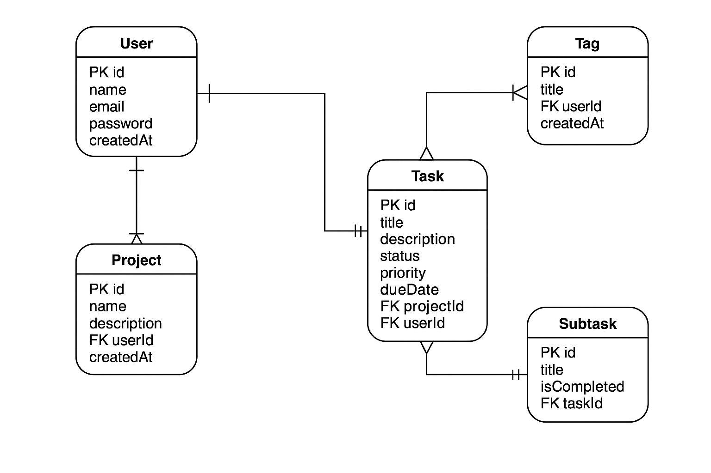

# ✅ Task Manager API

A full-featured RESTful API built with **Node.js**, **Express**, and **MongoDB** for managing users, tasks, projects, and tags. This project uses centralized error handling, token-based authentication, and clean separation of concerns using MVC architecture.

---

## 🚀 Features

- 🧑 User registration & login (JWT auth)
- 📁 Projects CRUD
- ✅ Tasks with deadlines, priority, and tag support
- 🏷️ Tags for organizing tasks
- 🔐 Protected routes (with token-based middleware)
- ⚠️ Centralized error handling
- 📊 Future: Role-based access control (e.g. Admin routes)

---

## 🧩 Entity Relationship Diagram (ERD)




---

## 🧰 Tech Stack

- **Backend:** Node.js, Express.js
- **Database:** MongoDB (via Mongoose)
- **Auth:** JSON Web Tokens (JWT)
- **Dev Tools:** Insomnia, dotenv, helmet, cors

---

## 📦 Getting Started

### 1. Clone the repo
```bash
git clone https://github.com/earvin-tech/task_manager
cd task_manager
```
### 2. Install dependencies
```bash
npm install
```
### 3. Create ```.env``` in root directory
```env
PORT=5000
DATABASE_URL=mongodb://localhost:27017/taskmanager
JWT_SECRET_KEY=taskKey12345
```
## ▶️ Running the App

To run the app in development mode:
```bash
npm run dev
```
To run the app in production mode:
```bash
npm run start
```
Make sure your MongoDB server is running locally (or update the DATABASE_URL to use a remote instance).

Visit http://localhost:5000 to verify the server is live.